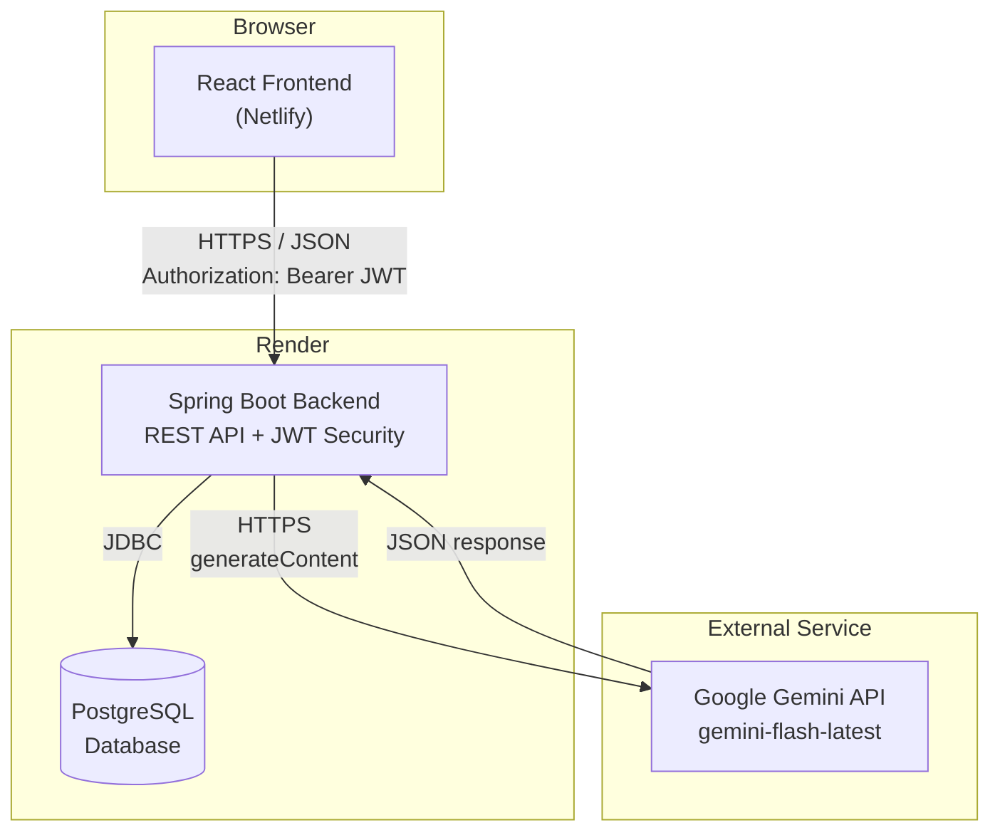
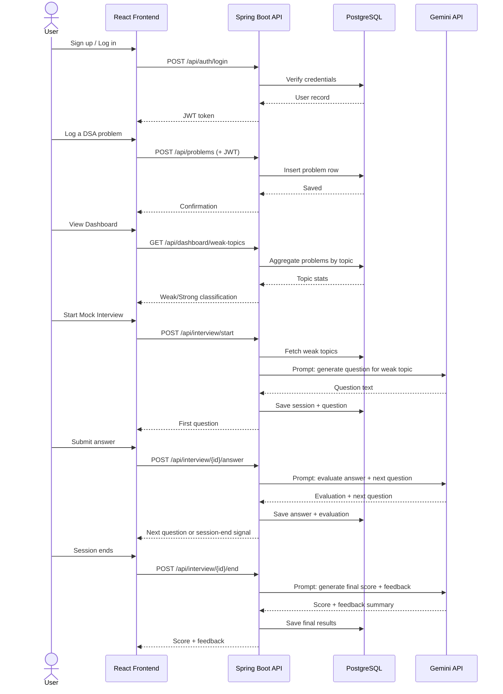
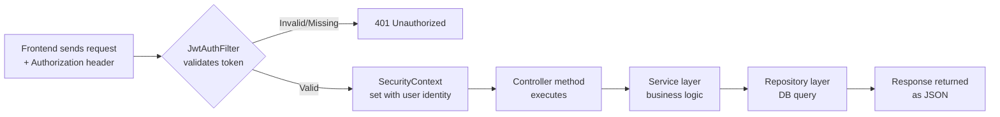
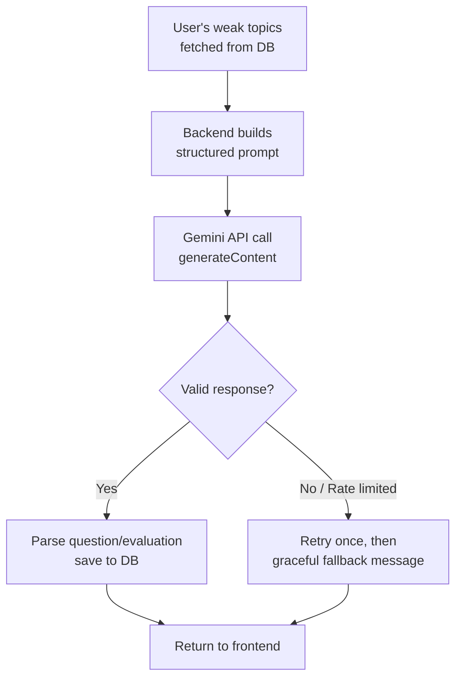

# PrepIQ — System Architecture

**Version:** 1.0 (Day 2)
**Status:** Locked for implementation — do not redesign without flagging a critical issue

---

## 1. Tech Stack (Final)

| Layer | Technology | Justification |
|---|---|---|
| Frontend | React (Vite) | Founder's existing comfort; Vite is faster/simpler than CRA |
| Backend | Spring Boot 3.x (Java) | Matches active learning (JWT, Security); reinforces real skills |
| Database | PostgreSQL | Free on Render; strong enum/JSON support; industry-standard |
| Auth | Spring Security + JWT (jjwt) | Already studied this topic; zero new learning curve |
| AI | Google Gemini API — `gemini-flash-latest` (fallback: `gemini-flash-lite-latest`) | Free tier as of Aug 2026; sufficient reasoning for structured Q&A |
| Backend Hosting | Render (free Web Service + free Postgres) | No cost; founder has prior deployment experience |
| Frontend Hosting | Netlify (free tier) | No cost; founder has prior deployment experience |
| Other Tools | Postman, Lombok, React Router, Axios | Free, standard, minimal learning curve |

**Note on Gemini model naming:** Google renames/deprecates Gemini models periodically. Using the `-latest` alias avoids hardcoding a version string that may be retired mid-capstone. As of August 2026, Flash-tier models remain free; Pro-tier models became paid-only in April 2026 — Flash is the correct free-tier choice for this project's scope.

---

## 2. Component Diagram

---

## 3. Data Flow — Core User Journey

---

## 4. Request Lifecycle (Authenticated Request)

---

## 5. AI Interaction Detail

**Design decision:** All Gemini calls happen server-side only. The API key never reaches the frontend. This is both a security requirement and matches the PRD's non-functional requirements.

---

## 6. External Services

| Service | Purpose | Failure Handling |
|---|---|---|
| Google Gemini API | Question generation, answer evaluation, final scoring | Retry once on failure; show user-friendly error if still failing; never expose raw API errors to frontend |
| Render (hosting) | Backend + DB hosting | Free tier cold-start delay is expected behavior, not a bug |
| Netlify (hosting) | Frontend hosting | N/A — static hosting, minimal failure surface |

---

## 7. Architecture Decisions Log

| Decision | Reasoning | Conflicts with Day 1 docs? |
|---|---|---|
| `gemini-flash-latest` instead of hardcoded version | Gemini model names change; alias avoids future breakage | No — Blueprint said "Gemini API," model name wasn't previously specified |
| All AI calls server-side only | Security best practice; PRD implies this via NFRs | No — consistent with PRD |
| PostgreSQL confirmed over MySQL | Better enum/JSON support, free on Render | No — PRD listed both as options, this finalizes the choice |

No PRD or Blueprint conflicts requiring approval today.