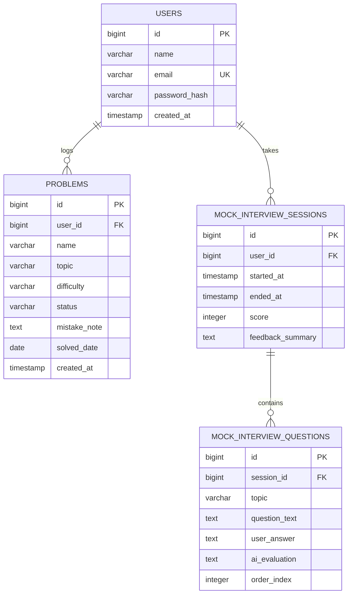

# PrepIQ — Database Schema (SCHEMA.md)

**Version:** 1.0 (Day 2)
**Database:** PostgreSQL

---

## 1. Entity Relationship Diagram

---

## 2. Table Definitions

### 2.1 `users`

| Column | Type | Constraints | Notes |
|---|---|---|---|
| id | BIGINT | PK, auto-increment | |
| name | VARCHAR(100) | NOT NULL | |
| email | VARCHAR(150) | NOT NULL, UNIQUE | Used for login |
| password_hash | VARCHAR(255) | NOT NULL | BCrypt hash, never plaintext |
| created_at | TIMESTAMP | NOT NULL, default now() | |

### 2.2 `problems`

| Column | Type | Constraints | Notes |
|---|---|---|---|
| id | BIGINT | PK, auto-increment | |
| user_id | BIGINT | FK → users.id, NOT NULL | Cascade delete on user removal |
| name | VARCHAR(200) | NOT NULL | Problem title, e.g. "Two Sum" |
| topic | VARCHAR(50) | NOT NULL | Enum: Arrays, Strings, LinkedList, Trees, Graphs, DP, Recursion, SlidingWindow, Stack, Queue, HashMap, Greedy, Backtracking, Other |
| difficulty | VARCHAR(20) | NOT NULL | Enum: Easy, Medium, Hard |
| status | VARCHAR(20) | NOT NULL | Enum: Solved, Attempted, Failed |
| mistake_note | TEXT | NULLABLE | Optional free-text note |
| solved_date | DATE | NOT NULL | |
| created_at | TIMESTAMP | NOT NULL, default now() | |

**Index:** `(user_id, topic)` — supports the weak-topic aggregation query used daily by the dashboard.

### 2.3 `mock_interview_sessions`

| Column | Type | Constraints | Notes |
|---|---|---|---|
| id | BIGINT | PK, auto-increment | |
| user_id | BIGINT | FK → users.id, NOT NULL | |
| started_at | TIMESTAMP | NOT NULL, default now() | |
| ended_at | TIMESTAMP | NULLABLE | Null while session in progress |
| score | INTEGER | NULLABLE | Set only when session ends |
| feedback_summary | TEXT | NULLABLE | Set only when session ends |

### 2.4 `mock_interview_questions`

| Column | Type | Constraints | Notes |
|---|---|---|---|
| id | BIGINT | PK, auto-increment | |
| session_id | BIGINT | FK → mock_interview_sessions.id, NOT NULL | Cascade delete with session |
| topic | VARCHAR(50) | NOT NULL | Which weak topic this question targets |
| question_text | TEXT | NOT NULL | |
| user_answer | TEXT | NULLABLE | Null until user answers |
| ai_evaluation | TEXT | NULLABLE | Null until evaluated |
| order_index | INTEGER | NOT NULL | Sequence within the session (1, 2, 3...) |

---

## 3. Relationships & Constraints

- One `user` → many `problems` (1:N, cascade delete)
- One `user` → many `mock_interview_sessions` (1:N, cascade delete)
- One `mock_interview_session` → many `mock_interview_questions` (1:N, cascade delete)
- `users.email` is globally unique — enforced at DB level, not just application level
- All foreign keys enforce referential integrity (`ON DELETE CASCADE`) — deleting a test user during development cleanly removes their data

---

## 4. Schema Validation Against PRD User Stories

| PRD Feature (Section 5) | Schema Support |
|---|---|
| 5.1 Authentication | `users` table with hashed password, unique email |
| 5.2 Manual DSA problem logging | `problems` table — all required fields present (topic, difficulty, status, mistake_note, date) |
| 5.3 Progress dashboard + weak-topic detection | Achieved via aggregation query on `problems` grouped by `(user_id, topic)` — no extra table needed, rule is computed, not stored |
| 5.4 AI Mock Interview (dynamic questioning) | `mock_interview_sessions` + `mock_interview_questions` capture the full Q&A transcript per session, enabling the AI to reference prior answers within a session |
| 5.5 Score & feedback | `mock_interview_sessions.score` and `feedback_summary` |
| 5.6 Deployment | N/A — infrastructure, not schema |

**Every v1.0 feature from the PRD has full schema support. No gaps identified.**

**Deliberate simplification:** Weak-topic classification is **computed on read** (aggregation query), not stored in its own table. Storing it would require a background job to keep it in sync — unnecessary complexity for this scale and timeline. This is consistent with the PRD's instruction to keep weakness detection "rule-based... not ML" (Section 6).