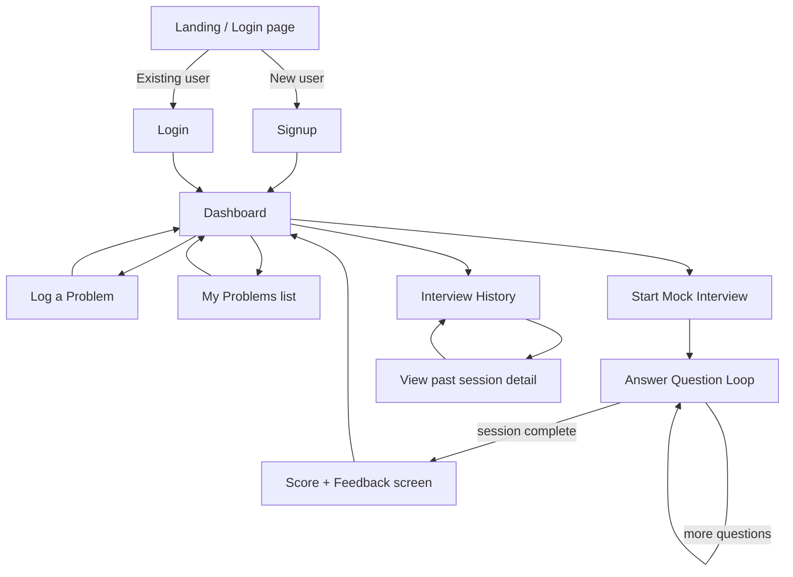
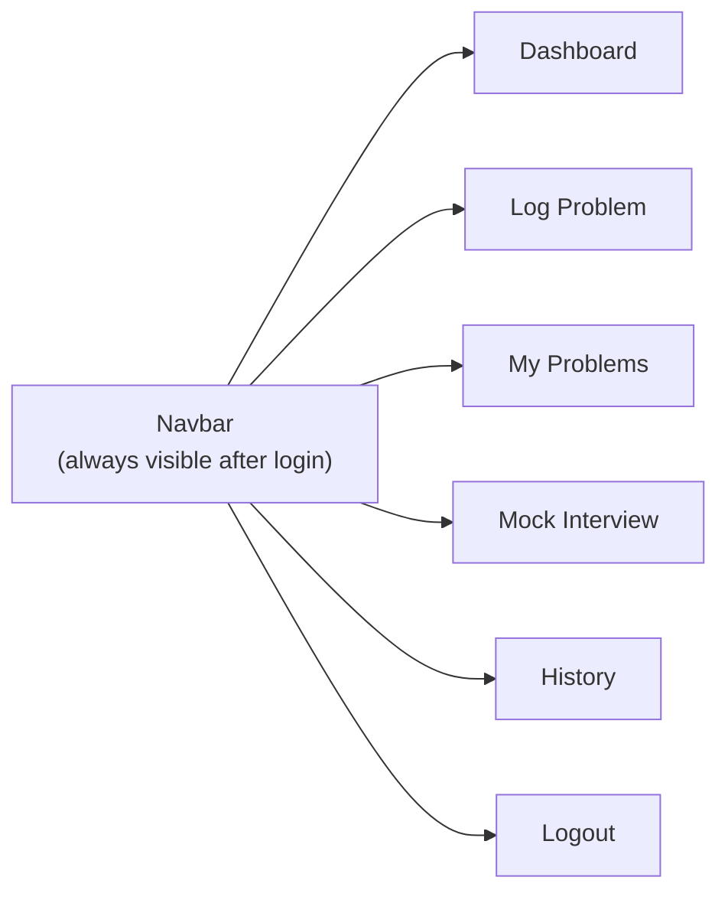

# PrepIQ — UI & User Flow (UI-WIREFRAMES.md)

**Version:** 1.0 (Day 2)
**Fidelity:** Low-fidelity (structure only — visual design happens during implementation, not today)

---

## 1. User Flow Diagram

---

## 2. Screen Inventory

| Screen | Purpose | Reachable From |
|---|---|---|
| Login | Authenticate existing user | Landing, logout redirect |
| Signup | Create new account | Landing |
| Dashboard | Home base — topic-wise stats, weak topics, navigation hub | Login/Signup success, Navbar |
| Log a Problem | Form to record a solved/attempted problem | Dashboard, Navbar |
| My Problems | List/edit/delete logged problems | Dashboard, Navbar |
| Mock Interview | Active Q&A session with AI | Dashboard, Navbar |
| Score + Feedback | Post-session results | End of Mock Interview |
| Interview History | List of past sessions | Dashboard, Navbar |

**Every screen exists for a reason** — no screen is decorative; each maps directly to a PRD v1.0 feature (Section 5).

---

## 3. Navigation Structure

A persistent navbar/sidebar (built Day 8) ensures every authenticated screen is one click away — no dead ends.

---

## 4. Low-Fidelity Wireframes

### 4.1 Login / Signup

┌─────────────────────────────────┐
│ PrepIQ │
│ │
│ [ Email input ] │
│ [ Password input ] │
│ │
│ [ Log In ] │
│ │
│ Don't have an account? Sign up│
└─────────────────────────────────┘
### 4.2 Dashboard

┌───────────────────────────────────────────┐
│ Navbar: Dashboard | Log Problem | Problems │
│ | Mock Interview | History | ⎋ │
├───────────────────────────────────────────┤
│ Weak Topics Summary │
│ [ DP: Weak ] [ Graphs: Weak ] │
│ │
│ Topic Breakdown (cards, color-coded) │
│ [Arrays: Strong] [Strings: Developing] │
│ [DP: Weak] [Trees: Strong] │
│ │
│ [ Start Mock Interview ] │
└───────────────────────────────────────────┘

### 4.3 Log a Problem
┌───────────────────────────────────┐
│ Navbar │
├───────────────────────────────────┤
│ Log a Problem │
│ │
│ Problem name: [__________] │
│ Topic: [dropdown v] │
│ Difficulty: [dropdown v] │
│ Status: [dropdown v] │
│ Mistake note: [textarea__] │
│ Date: [date picker] │
│ │
│ [ Save ] │
└───────────────────────────────────┘
### 4.4 My Problems (List)

┌────────────────────────────────────────────┐
│ Navbar │
├────────────────────────────────────────────┤
│ My Problems │
│ ┌──────────────────────────────────────┐ │
│ │ Two Sum | Arrays | Easy | Solved ✎ 🗑│ │
│ │ Merge Intervals | Arrays | Med | ...✎🗑│ │
│ │ Knapsack | DP | Hard | Attempted ✎ 🗑 │ │
│ └──────────────────────────────────────┘ │
└────────────────────────────────────────────┘

### 4.5 Mock Interview (Active Session)

┌───────────────────────────────────┐
│ Navbar │
├───────────────────────────────────┤
│ Mock Interview — Question 2 of 4 │
│ │
│ "How would you optimize the │
│ space complexity of that DP │
│ solution?" │
│ │
│ [ Answer textarea______________ ] │
│ │
│ [ Submit ] │
└───────────────────────────────────┘

### 4.6 Score + Feedback
┌───────────────────────────────────┐
│ Navbar │
├───────────────────────────────────┤
│ Session Complete │
│ │
│ Score: 72 / 100 │
│ │
│ Feedback: │
│ "Strong on problem framing, needs │
│ more practice on DP edge cases." │
│ │
│ [ Back to Dashboard ] │
└───────────────────────────────────┘

### 4.7 Interview History

┌────────────────────────────────────────┐
│ Navbar │
├────────────────────────────────────────┤
│ Interview History │
│ ┌────────────────────────────────────┐ │
│ │ Aug 14, 2026 | Score: 72 | DP, ... │ │
│ │ Aug 12, 2026 | Score: 58 | Arrays..│ │
│ └────────────────────────────────────┘ │
│ (click a row → view full transcript) │
└────────────────────────────────────────┘

---

## 5. Design Notes for Implementation Days (not decisions made today)

- Actual visual styling (colors, fonts, spacing) is an implementation-time decision, not a Day 2 planning decision — kept deliberately unstyled here.
- Desktop-first per PRD Non-Functional Requirements (Section 8) — mobile responsiveness is not required for v1.0.
- Loading states and error messages (Day 8 work) are not shown in these wireframes but are accounted for in API.md's error response design.